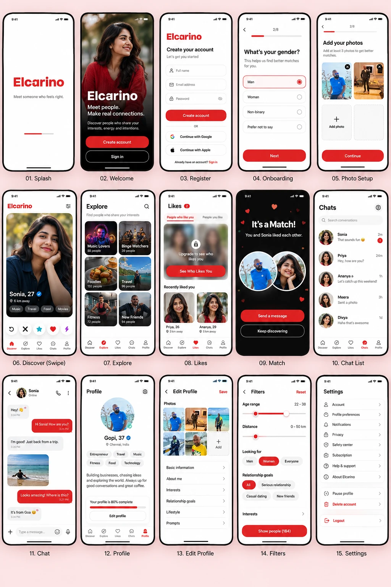

<div align="center">


### Meet someone who feels right.

A niche-focused dating app built around meaningful connections, verified profiles and
strong safety tooling — a **Flutter** mobile client on a **Laravel 13** API.

Launching in **Malaysia**, then the **Maldives** and **India**.

[](https://github.com/goesscay/elcarino/actions/workflows/backend.yml)
[](https://github.com/goesscay/elcarino/actions/workflows/mobile.yml)

</div>

---

## Contents

1. [Design layout](#design-layout)
2. [Where the project stands](#where-the-project-stands)
3. [Features](#features)
4. [Tech stack](#tech-stack)
5. [Architecture](#architecture)
6. [Getting started](#getting-started)
7. [Testing and CI](#testing-and-ci)
8. [Design system](#design-system)
9. [API overview](#api-overview)
10. [Roadmap](#roadmap)
11. [Known gaps and unverified integrations](#known-gaps-and-unverified-integrations)
12. [Open decisions](#open-decisions)
13. [Documentation map](#documentation-map)
14. [Working in this repo](#working-in-this-repo)
15. [Licence](#licence)

---

## Design layout

The target UI for the mobile app: fifteen screens, from splash to settings. The visual
language is white-dominant with a single confident red, an original Elcarino design
rather than a copy of any existing dating app.

<p align="center">
  
</p>

### How the built app maps to that layout

| # | Screen | State | Notes |
|---|---|---|---|
| 01 | Splash | ✅ Built | Uses the unmodified logo asset |
| 02 | Welcome | ✅ Built | Create account / Sign in |
| 03 | Register | ✅ Built | Email and phone + OTP. Google / Apple buttons are present but show "coming soon" (need real OAuth client IDs) |
| 04 | Onboarding | ✅ Built | Profile basics, prompts and preferences steps, resumable from the API |
| 05 | Photo setup | ✅ Built | Upload, remove, reorder with left/right controls (no drag-and-drop yet), "Main" badge, "In review" state |
| 06 | Discover (swipe) | ✅ Redesigned | Swipe card stack with a live drag peek, Pass / Like / Boost row, Filters entry. **No** Undo, Super Like, verified badge or location line |
| 07 | Explore | ✅ Built | A grid of interest tiles with people counts, category chips and search. Counts are people you could actually be shown; tap a tile → those people, with Like / Pass. Icon tiles, not photographic ones |
| 08 | Likes | ✅ Built | Two tabs. **People who like you** is premium: a free user gets the *count* and an upgrade prompt, and the API sends no people at all. **People you like** is free. Tap a person → full profile with Like / Pass. No "Recently liked you" strip |
| 09 | Match | ✅ Redesigned | Dark celebration screen, animated overlapping photos, **Send a message** / **Keep discovering** |
| 10 | Chat list | ✅ Redesigned | New-matches row and conversations. **No** search, **no** unread badge |
| 11 | Chat | ✅ Redesigned | Bubbles, date separators, read receipts, typing indicator, voice notes, photos, GIFs, voice and video calls |
| 12 | Profile | ✅ Redesigned | Photo header, interests, bio, completeness meter, a **Get verified** card and the verified badge. **No** location line |
| 13 | Edit profile | ✅ Redesigned | Photos plus grouped section rows (Basics & bio, Interests, Prompts, Preferences) |
| 14 | Filters | ✅ Redesigned | "Show people" / "Reset", age and distance sliders, looking-for and goal chips |
| 15 | Settings | ✅ Redesigned | Grouped cards; Log out and Delete account set apart at the bottom |

Bottom navigation is **five tabs** (Discover, Explore, Likes, Chats, Profile), matching
the layout. Everything still marked "not built" is recorded, with the reason, in
[`docs/07-ui-ux-design.md`](docs/07-ui-ux-design.md).

---

## Where the project stands

**Phases 0 through 3 are complete. Phase 4 (AI) is under way: selfie verification is built;
compatibility scoring, recommendations and icebreakers wait on client decisions. Phase 5
(production hardening) has not started.**

| | |
|---|---|
| Backend tests | **385 passing** |
| Mobile tests | **249 passing**, `flutter analyze` clean, `dart format` clean |
| UI redesign | Merged ([#2](https://github.com/goesscay/elcarino/pull/2)) — theme, tab shell and nine screens |
| Likes tab | Built — premium "who liked me" enforced by the API, plus "people you like" and a shared profile-detail screen |
| Explore tab | Built — browse people by interest, using the same eligibility as the Discover deck |
| Verification | Built end to end (backend, admin review queue, mobile). **No real face-match provider is wired**: by default every selfie goes to human review |
| Verified live | Two-emulator voice and video calls, real-time chat, voice notes, photos, GIF picker states, admin panel with TOTP |
| Not verified live | Stripe, Firebase push, Twilio SMS, Giphy, iOS (no credentials or toolchain on the dev machine) — see [Known gaps](#known-gaps-and-unverified-integrations) |

---

## Features

### Accounts and onboarding
- Sign up and sign in with **email + password** or **phone + OTP**; forgot / reset password
- Google and Apple ID-token verification on the backend (mobile buttons are placeholders until OAuth is configured)
- Onboarding: profile basics → photos → prompts → preferences → location and notification permission
- An `OnboardingGate` resolves a resumed session's next step from the API, not from a client-side flag
- 18+ enforced at signup via `birth_date`

### Profiles
- Up to **6 photos** with server-side **EXIF stripping** and signed URLs; reorder and remove
- Interests, bio, relationship goal, religion and politics (the last two are private and only used for filtering)
- Prompt library: answer, swap, edit, remove and drag to reorder
- Profile completeness meter

### Discovery and matching
- Paginated feed filtered by the viewer's own preferences (gender, age, distance, relationship goal)
- Ranked by **shared interests**, then **bucketed** distance — never by raw distance
- Swipe like / pass with a gesture card stack and accessible buttons; a mutual like creates a match and a conversation
- Excludes swiped, blocked, suspended and banned users
- **Profile boost** (subscriber perk): an active boost ranks a candidate first for a configurable window

### Likes
- **Who liked me** (subscriber): a grid of everyone waiting on a reply, newest first; tap for their full profile and **Like / Pass**. A mutual like plays the match celebration and the person leaves the grid
- **Free users see a count, not people.** The API returns `locked: true` and no identities, photos or ids, so there is nothing to blur client-side or scrape. Subscribing from the prompt unlocks the tab in place
- **People you like** (free): your pending likes, read-only
- Both lists hide inactive, blocked and already-matched people
- A push for a new like opens this tab (and names no one)

### Profile verification
- A **Get verified** card on the profile opens a guided selfie: the server picks a pose (e.g. "Show a peace sign"), the person takes a **front-camera** selfie showing it, and the answer comes back on the spot
- A confident match is approved automatically. The AI may reject only for "no face detected"; **a non-match or a low score is never an automatic rejection, it goes to a person**, because face-match models fail unevenly across skin tones and lighting
- A **Filament review queue** for admins and moderators: view the selfie (every view is audit-logged), approve, or reject with a reason. Two reviewers can't both decide one request
- **Selfies are treated as critical data:** encrypted with the app key before they touch disk, deleted the moment a decision is made, and the person never sees the matcher's score
- The provider is an open decision. With none configured, everything goes to the queue: a badge is never handed out by default

### Explore
- A grid of interest tiles (Sports, Arts, Food & drink, Lifestyle, Learning...), most popular first, each with **how many people you could actually be shown** who share it, and a tick on the ones already on your profile
- Category chips and search narrow the grid; tap a tile for those people, then their full profile with **Like / Pass**
- It uses the Discover deck's own eligibility (your filters, distance, blocks and earlier swipes), so a tile never opens onto someone the deck would hide, and a person disappears once you've answered them
- Free for everyone

### Chat
- Real-time messaging over **Laravel Reverb** (WebSockets): typing indicator, online status, read receipts
- **Voice notes**, **photos** and **GIFs** behind one "+" attachment menu
- Messaging people you haven't matched with is a **subscriber-only** feature, enforced at the API

### Voice and video calls
- **WebRTC**, peer to peer, no third-party calling vendor
- Signalling reuses the chat presence channel; the backend owns the call state machine (ringing → active → ended / missed / declined)
- Subscriber-only, enforced at the API when the call token is issued

### Safety
- Block, unblock, report (with "also block") and unmatch, reachable from a conversation's overflow menu
- Blocking also unmatches; blocked users are excluded from discovery and from the inbox
- Rate-limited reporting; audit log for every admin action

### Premium
- Subscription plans, purchase flow (Stripe by default; App Store / Play Store receipt verification also implemented), cancel, payment history
- Plans and entitlements are **data**, not code: no price is hard-coded anywhere
- Gated: advanced filters (religion, politics), boost, unmatched messaging, voice and video calls

### Notifications
- Push for new match, new message and like, deep-linking into the right conversation
- The "like" notification carries **no liker identity**, so it can't leak "who liked me" for free

### Admin panel (`/admin`, Filament)
- Session login with **mandatory TOTP two-factor**; admin and moderator roles are provisioned, never self-service
- User management: search, filter, suspend / reinstate / ban / delete. Ban and delete are admin-only
- Reports queue: mark actioned, dismiss, or suspend the reported user in one click
- Subscription plans (full CRUD), subscriptions (cancel) and payments (read-only)
- Dashboard: users, matches, messages, pending reports, premium users and revenue

---

## Tech stack

| Layer | Technology |
|---|---|
| Mobile | Flutter 3.47 (Dart 3), **Riverpod 3**, go_router 18, Dio |
| Real-time (mobile) | `pusher_reverb_flutter` (pure Dart, works with a self-hosted Reverb server) |
| Calls | `flutter_webrtc` |
| Media | `record`, `audioplayers`, `image_picker`, `geolocator` |
| Storage / security (mobile) | `flutter_secure_storage` for the API token |
| Push (mobile) | `firebase_core`, `firebase_messaging` |
| Backend | **Laravel 13**, PHP 8.3+, Sanctum bearer tokens |
| Real-time (backend) | Laravel Reverb, presence channels |
| Admin | Filament 5 |
| Database | SQLite locally and in tests, **PostgreSQL 16** in staging, production and a CI parity job |
| Payments | Stripe REST (default), App Store / Play Store receipt verifiers |
| SMS / push | Twilio (OTP), Firebase Cloud Messaging v1, both behind provider interfaces with a `log` driver for local work |
| Quality | PHPUnit 12 + Pint (backend); `flutter test`, `flutter analyze`, `dart format` (mobile) |

---

## Architecture

```
/backend    Laravel API                    (API, admin panel, WebSockets)
/mobile     Flutter app                    (iOS and Android)
/docs       Engineering specification      (source of truth for scope)
/branding   Logo and brand assets
/proposal   Client-facing decks            (reference only)
/.github    CI workflows                   (backend.yml, mobile.yml)
```

### Backend (`backend/app`)

Thin controllers, with every mutating endpoint using a **Form Request** (validation), a
**Policy** (authorization) and an **API Resource** (response shape). Business rules live
in services:

```
Services/
  Auth · Discovery · Explore · Likes · Matching · Geo · Media · Safety
  Calls · Gifs · Notifications · Push · Sms · Verification
  Subscriptions · Payments · Admin
Filament/        admin resources, widgets and the panel provider
Policies/        SwipePolicy, UserMatchPolicy, ConversationPolicy, CallPolicy, ...
Events/          NewMessageBroadcast, MessagesReadBroadcast, call events
```

Third-party integrations sit behind small interfaces (`SmsSender`, `PushSender`,
`PaymentGateway`, `ReceiptVerifier`, `GifProvider`). A `log` driver is the default, so
the whole app runs locally with no external accounts.

### Mobile (`mobile/lib`)

Feature-first Clean Architecture: each feature has `presentation/`, `domain/` and
`data/`. Only genuinely shared code lives in `core/`.

```
lib/
  authentication · onboarding · profile · discovery · explore · matching · likes · verification
  chat · calls · safety · settings · subscriptions · notifications
  core/
    theme/     AppColors, AppPalette, AppTypography, AppSpacing, AppTheme
    widgets/   AppLogo, NetworkPhoto, StateMessage, SectionCard, MainShell
    network/   the single typed API client
    router/    go_router config and the tab shell
    config/    build-time AppConfig
```

State management is **Riverpod only**. All networking goes through one typed API client
that mirrors [`docs/03-api-specification.md`](docs/03-api-specification.md).

### Rules enforced on the server, not in the UI

- **Unmatched messaging** and **calls** are subscriber-gated and return `403` from the API. Hiding a button is never the control.
- **Premium filters** fail closed at write time and are re-checked independently when the feed is built.
- **Suspended and banned** users can't log in, appear in discovery, or send messages, and their sessions are revoked immediately.
- **Location:** exact coordinates are stored, but clients only ever receive a **bucketed** distance, and the feed never sorts by raw distance (anti-triangulation). Location updates are rate-limited.

---

## Getting started

Windows-first (that's the dev machine); the commands translate directly to macOS and
Linux. Full detail and known gotchas: [`docs/08-environment-setup.md`](docs/08-environment-setup.md).

**Prerequisites:** PHP 8.3+ (with `pdo_sqlite`, `sqlite3`, `mbstring`, `openssl`, `gd`),
Composer 2, Flutter stable (3.47), JDK 17 and the Android SDK for Android builds. No
Docker, Redis or PostgreSQL is needed locally.

### 1. Backend

```powershell
cd backend
composer install
Copy-Item .env.example .env
php artisan key:generate
New-Item -ItemType File database\database.sqlite -Force   # Laravel won't create it for you
php artisan migrate
php artisan serve                                          # http://127.0.0.1:8000
```

For real-time chat, set `BROADCAST_CONNECTION=reverb` and choose any values for
`REVERB_APP_ID`, `REVERB_APP_KEY` and `REVERB_APP_SECRET` (Reverb is self-hosted, so
these aren't third-party secrets). Then run Reverb next to the API:

```powershell
php artisan reverb:start                                   # ws://127.0.0.1:8080
```

### 2. Mobile

```powershell
cd mobile
flutter pub get
flutter run --dart-define-from-file=config/dev.json
```

`config/dev.json` points the Android emulator at the host machine via `10.0.2.2`.
It carries the API base URL and the Reverb host, port and app key, which must match the
backend's `.env`.

> **Emulator note:** profile photos are signed against `APP_URL`. To see real profile
> photos on the emulator, temporarily set `APP_URL=http://10.0.2.2:8000` and restart
> `php artisan serve`. Chat media is unaffected.

### 3. Admin panel

Admin and moderator accounts are created, never self-registered. See
[`docs/08-environment-setup.md`](docs/08-environment-setup.md#admin-panel-filament-phase-1-item-11)
for the `tinker` snippet, then open `http://127.0.0.1:8000/admin`. First login forces
authenticator-app (TOTP) setup.

### Environments

| Env | Database | Configured by |
|---|---|---|
| Local | SQLite file | `backend/.env` |
| Tests | SQLite in memory | `phpunit.xml` |
| Staging / production | PostgreSQL 16 | platform secrets, never a committed `.env` |

Mobile builds pick their environment with `--dart-define-from-file=config/{dev,staging,prod}.json`.
`.env.example` documents every backend key; nothing sensitive is committed.

---

## Testing and CI

```powershell
# Backend: 385 tests
cd backend
php artisan test
./vendor/bin/pint --test

# Mobile: 249 tests. The dart-define file is required: AppConfig fails loudly without it.
cd mobile
flutter test --dart-define-from-file=config/dev.json
flutter analyze
dart format --output=none --set-exit-if-changed .
```

GitHub Actions runs both suites on every push and pull request touching their folder.
The backend also re-runs against **PostgreSQL 16** to catch SQLite/Postgres differences
before staging. **A task counts as done when tests, analyze and format all pass.**

Backend tests cover every endpoint's happy path and its main authorization failure.
Mobile tests use fake repositories, GoRouter hosts for navigation assertions, and a tall
test surface for lazy lists.

---

## Design system

The redesign is presentation-only: no business logic, API, model or auth change. The
palette is roughly **70% neutral, 20% surface, 10% red**, and dark mode is designed
rather than inverted.

| Token | Light | Dark |
|---|---|---|
| Primary | `#DC2626` | `#DC2626` |
| Primary dark | `#B91C1C` | `#B91C1C` |
| Primary tint | `#FEE2E2` | dark-adjusted tint |
| Background | `#FAFAFA` | `#111111` |
| Surface | `#FFFFFF` | `#1C1C1E` |
| Text | `#111111` | `#FFFFFF` |
| Secondary text | `#6B6B6B` | `#A1A1AA` |
| Border | `#E5E5E5` | dark border |

- **Spacing:** 8-pt scale (4 / 8 / 12 / 16 / 20 / 24 / 32 / 40), 20 px screen padding
- **Radii:** 8 / 12 / 16, cards 20–24, buttons 16, pills fully round
- **Type:** system font in three weights
- **No hard-coded colours in widgets.** Screens read `context.palette`, so a widget never picks a light or dark constant itself. Colours over photos have their own tokens (`onPhoto`, `photoScrim`, `photoControl`, ...)
- **Shared components:** `AppLogo` (the brand asset, byte-for-byte from `/branding`), `NetworkPhoto`, `StateMessage`, `SectionCard` / `SectionRow`, `MainShell`

Token tables and per-screen specs: [`docs/07-ui-ux-design.md`](docs/07-ui-ux-design.md).
Brand assets: [`branding/README.md`](branding/README.md).

---

## API overview

REST, JSON, bearer-token auth (Sanctum), versioned under `/api/v1`. Two documented error
shapes, mapped to typed exceptions on the client. The full catalogue with request and
response shapes is in [`docs/03-api-specification.md`](docs/03-api-specification.md).

| Area | Endpoints |
|---|---|
| Auth | `register`, `login`, `logout`, `otp/request`, `otp/verify`, `password/forgot`, `password/reset`, `oauth/google`, `oauth/apple` |
| Profile | `profiles/me` (+ `photos`, `photos/order`), `prompts` and `prompts/me`, `interests` and `interests/me`, `preferences/me`, `users/me`, `users/me/location` |
| Discovery | `discovery/feed`, `discovery/boost`, `swipes` |
| Verification | `verification/challenge`, `verification/request` (multipart selfie), `verification/status` |
| Explore | `explore/interests`, `explore/interests/{id}/people` |
| Likes | `likes/received` (subscriber-gated, count-only for free users), `likes/sent` |
| Matches | `matches`, `matches/{id}` (show, unmatch) |
| Chat | `chat/conversations`, `.../messages`, `.../read`, `gifs/search` |
| Calls | `calls/token`, `calls/{id}/answer`, `.../decline`, `.../end` |
| Safety | `safety/block`, `safety/blocks`, `safety/report`, `safety/report-categories` |
| Notifications | `notifications`, `users/me/devices` |
| Premium | `subscriptions`, `subscriptions/me`, `subscriptions/plans`, `subscriptions/cancel`, `payments/history` |
| Webhooks | `POST /api/webhooks/stripe`, authenticated by HMAC signature |

Real-time events travel over presence channels `presence-conversation.{id}`.

---

## Roadmap

| Phase | Scope | Status |
|---|---|---|
| **0** Architecture and design | Spec, schema, API, security review, wireframes, CI, scaffolds | ✅ Done (hi-fi prototype still outstanding) |
| **1** MVP | Auth, onboarding, profile, prompts, discovery, swipe and match, matching v1, chat, push, safety, admin v1 | ✅ Done |
| **2** Premium | Plans and purchase, advanced filters, boost, unmatched messaging, admin billing | ✅ Done, except Super Like / Rewind |
| **3** Communication | Voice notes, GIFs, photo sharing, voice calls, video calls | ✅ Done, with a TURN gap |
| **UI redesign** | Theme, tab shell, nine screens | ✅ Done and merged |
| **Likes** tab | "Who liked me" (premium) and "people you like", plus profile detail | ✅ Done |
| **Explore** tab | Interest categories with member counts, and the people behind them | ✅ Done |
| **4** AI | Selfie verification ✅ (no real provider yet). Compatibility scoring, recommendations, icebreakers | 🟡 In progress; the rest is paused on client decisions #24–25 |
| **5** Production | Security audit, load testing, store submission, deployment, monitoring, backups | ⬜ Not started |

Planning-level total: **20–28 weeks**. Each phase has a gate that must be met before the
next starts. Details, per-feature write-ups and gate assessments:
[`docs/04-development-phases.md`](docs/04-development-phases.md).

**Blocked, not skipped:** Super Like / Rewind waits on open decision #11. The reserved
`super` swipe direction and the pass-through endpoint already exist, so no rework is
needed when it's approved.

---

## Known gaps and unverified integrations

Stated plainly, so nobody assumes they work:

- **No TURN server.** Calls use STUN only. They connect on the same network and across most NATs, but **will fail behind symmetric or carrier-grade NAT**. This must be fixed before launch.
- **No background wake for calls.** A call only reaches the callee while their app has the conversation's channel open. There is no CallKit / ConnectionService wake and no missed-call push.
- **Untested against real providers** (none configured on the dev machine): Stripe, Firebase Cloud Messaging, Twilio, App Store / Play Store receipts. All are real implementations with unit tests, but each needs a first live check. **Giphy** needs a real API key; its unauthenticated fallback key is dead.
- **Stripe renewals:** `invoice.payment_succeeded` doesn't yet extend `ends_at` on renewal.
- **iOS** hasn't been built or run. Only Android was exercised.
- **Feed gating on photos:** candidates need at least one photo of *any* moderation status, because nothing can be approved until a moderation UI exists. Tighten to approved-only before real users.
- **No face-match provider (open decision #21).** Verification is built and tested, but the AI path has only ever run against a `fake` driver; every real selfie goes to human review until a provider and an approval threshold are chosen. Also **the verified badge is not revoked when the main photo changes**, so a verified person could swap in someone else's photo. Re-verifying on a photo change is the natural follow-up
- **Not built:** Undo / Super Like, opening a profile from a Discover card tap, the Likes "Recently liked you" strip, chat search, tab unread badge, notification centre, per-type notification toggles, account deletion UX, Help & Legal content, drag-and-drop photo reorder, report evidence attachments, verification review.
- **Throttled requests** return Laravel's default 429 body, not the app's error envelope.

---

## Open decisions

Thirty client decisions are tracked in
[`docs/05-open-decisions.md`](docs/05-open-decisions.md), each with a **working
assumption** so development isn't blocked. Code that leans on one carries a `TBD-#`
comment matching the tracker's numbering.

Confirmed so far include the brand (**Elcarino**), launch markets, the 18+ policy,
gender options (man / woman / non-binary), religion and politics as required filters,
subscriber-only unmatched messaging, and **WebRTC** for calls.

Still open and business-critical: target niche (#1), **pricing (#12)**, number of plans
(#11), the **face-match provider and approval threshold (#21)**, the compatibility formula
(#24) and AI icebreakers (#25).

---

## Documentation map

| Document | What it covers |
|---|---|
| [`docs/00-overview.md`](docs/00-overview.md) | Start here: scope, quick facts, how requirements are tagged |
| [`docs/01-technical-specification.md`](docs/01-technical-specification.md) | Product scope, architecture, module-by-module spec |
| [`docs/02-database-schema.md`](docs/02-database-schema.md) | Every table, column, key and index |
| [`docs/03-api-specification.md`](docs/03-api-specification.md) | REST catalogue with request and response shapes |
| [`docs/04-development-phases.md`](docs/04-development-phases.md) | Phase plan, gates, and what was actually built and found |
| [`docs/05-open-decisions.md`](docs/05-open-decisions.md) | The 30 client decisions and current assumptions |
| [`docs/06-security-architecture.md`](docs/06-security-architecture.md) | Threat model, auth, geolocation privacy, rate limits |
| [`docs/07-ui-ux-design.md`](docs/07-ui-ux-design.md) | Screens, navigation, design system, built-vs-not-built |
| [`docs/08-environment-setup.md`](docs/08-environment-setup.md) | Local setup, environments, gotchas |
| [`CLAUDE.md`](CLAUDE.md) | Working rules for contributors and AI assistants |
| [`branding/`](branding) | Logo (SVG and PNG), colour, app icon notes |
| [`proposal/`](proposal) | Client-facing proposal and cost decks (reference only) |

---

## Working in this repo

- **One feature at a time**, in the order the phase plan lays out: read the spec → implement → write tests → self-review the diff → fix → commit. Don't start the next phase before the current gate is met.
- **One commit per completed, tested feature**, with conventional-style messages (`feat(chat): ...`, `fix(auth): ...`, `docs: ...`).
- **Docs move with code.** A change to scope, schema or an endpoint updates the matching file in `/docs` in the same commit.
- **Migrations mirror `docs/02` exactly** and stay portable across SQLite and PostgreSQL.
- **Don't invent business decisions.** Implement the stated working assumption, tag it `TBD-#`, and ask if a task genuinely can't proceed.

Full conventions for backend, mobile, commits and open decisions: [`CLAUDE.md`](CLAUDE.md).

---

## Licence

No licence file is present. Until one is added, treat this codebase as proprietary to
MGS and its client, with all rights reserved.
